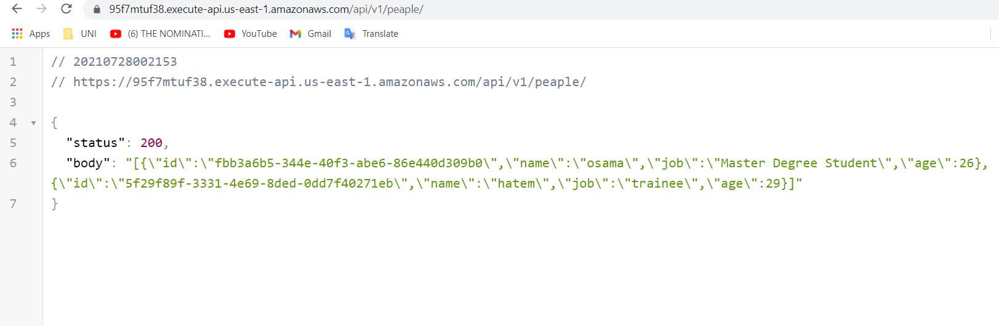
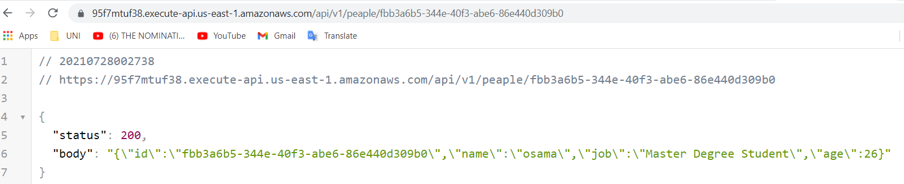
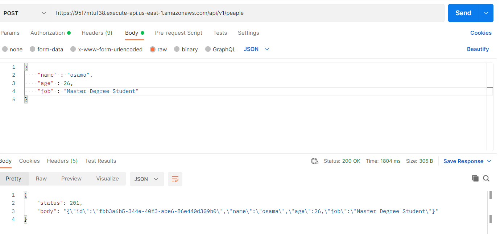
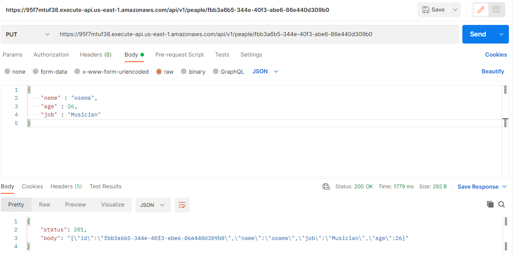
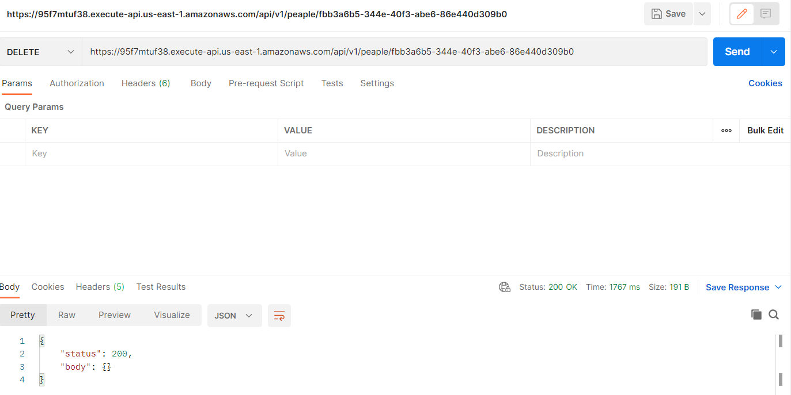
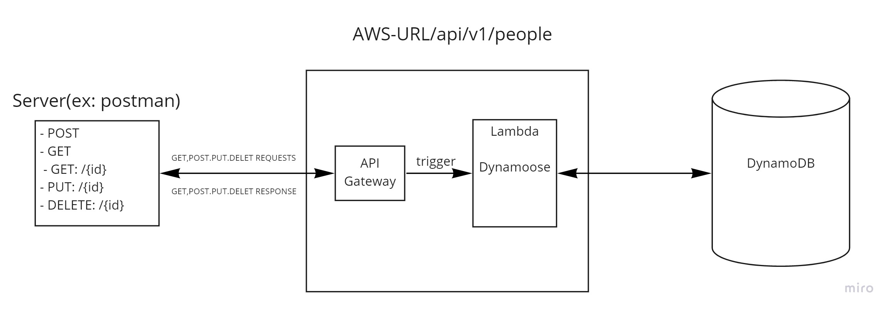

# serverless-api

### Author : Hatem Husnieh

## install

1. copy the link of the repo
1. clone the repo on your local machine by `git clone repo-url`
1. download independencies by `npm i`

## Deploy, Run and Test

- [deployed link](https://95f7mtuf38.execute-api.us-east-1.amazonaws.com)
- [Pull Request](https://github.com/Hatemhusnieh/serverless-api-/pull/1)

## Routes:

- Root URL: `https://95f7mtuf38.execute-api.us-east-1.amazonaws.com`

- GET: `https://95f7mtuf38.execute-api.us-east-1.amazonaws.com/api/v1/peaple/`.
  - Inputs: `none`.
  - Return all instances in DynamoDB in an object.  
    
- GET/id: `https://95f7mtuf38.execute-api.us-east-1.amazonaws.com/api/v1/peaple/<{id}>`.
  - Inputs: `id` in params.
  - Return single object.  
    
- POST: `https://95f7mtuf38.execute-api.us-east-1.amazonaws.com/api/`.
  - Inputs: `none`.
  - Return added instance to DynamoDB.  
    
- PUT: `https://95f7mtuf38.execute-api.us-east-1.amazonaws.com/api/v1/peaple/<{id}>`.
  - Inputs: `id` in params.
  - Return an object.  
    
- DELETE: `https://95f7mtuf38.execute-api.us-east-1.amazonaws.com/api/v1/peaple/<{id}>`.
  - Inputs: `id` in params.
  - Return empty object.  
    

### UML:

